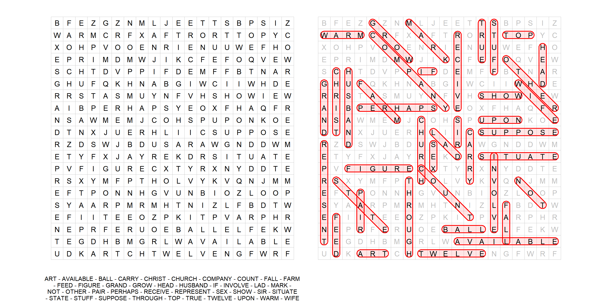

<!-- README.md is generated from README.Rmd. Please edit that file -->

# wordsearch

-   Whilst driving home from work the idea popped into my head to try
    and write a wordsearch generator in R
-   I wrote all of this in about 2 hours that evening - so its likely to
    be a bit rough with errors
    -   Sharing/documenting as it may be a good jumping off point for
        someone else to develop further!

``` r
library(tidyverse)
```

-   Define some parameters

``` r
# Set seed for reproducibility
seed <- 4

# Wordsearch dimensions
nx <- 20
ny <- 20

# Max number of attempts to place a word in the wordsearch
n_attempts <- 100

# Number of words to pick from the words vector
nwords <- 40
```

-   Create dataframe of words
-   Compute the number of characters per word and also split each word
    into its characters
-   Randomly assign an orientation to each word (this could be weighted
    how you like)
    -   1 = Horizontal (left to right)
    -   2 = Vertical (top to bottom)
    -   3 = Diagonal (top left to bottom right)
-   It would be fairly trivial to extend this by adding orientations
    that place the words horizontally right to left, vertically bottom
    to top or diagonally bottom right to top left
-   Initialise two columns that will be filled with the row start `rs`
    and column start `cs` indices when the word has been placed

``` r
set.seed(seed)

d <- 
    tibble(words = sample(toupper(words), nwords)) |>
    mutate(
        n_letters = nchar(words),
        letters = map(words, str_split_1, pattern=""),
        orientation = sample(1:3, size = n(), replace = TRUE),
        rs = NA,
        cs = NA)
```

-   Create a matrix to place the words into
-   Loop though each word randomly choosing a location to place it and
    checking if it fits
    -   The choice of locations to pick is reduced based on the
        orientation of the word

``` r
m <- matrix(nrow = ny, ncol = nx)

for(i in 1:nrow(d)){
    
    # Horizontal left to right
    if(d$orientation[i] == 1){  
        for(j in 1:n_attempts){
            
            # Pick a row and column
            r <- sample(1:ny, 1)
            ci <- sample(1:(nx-(d$n_letters[i]-1)), 1)
            
            # Compute the column range for the word
            c <- ci:(ci + (d$n_letters[i]-1))
            
            # If word can be placed - assign its letters to the matrix and update the dataframe
            # If it cant be placed after the max attempts, print warning and move to next word
            if(all(is.na(m[r, c]) | m[r, c] == d$letters[[i]])){
                m[r, c] <- d$letters[[i]]
                d$rs[i] <- r
                d$cs[i] <- ci
                break
            } else {
                if(j == n_attempts){
                    warning(paste0("'",d$words[i],"' not placed"))
                    break}
                next
            }
        }
        
    # Vertical top to bottom ---------------------------------------------------
    } else if(d$orientation[i] == 2){    
        for(j in 1:n_attempts){
            
            # Same as above, but one column and a row range
            c <- sample(1:nx, 1)
            ri <- sample(1:(ny-(d$n_letters[i]-1)), 1)
            r <- ri:(ri + (d$n_letters[i]-1))
            
            if(all(is.na(m[r, c]) | m[r, c] == d$letters[[i]])){
                m[r, c] <- d$letters[[i]]
                d$rs[i] <- ri
                d$cs[i] <- c
                break
            } else {
                if(j == n_attempts){
                    warning(paste0("'",d$words[i],"' not placed"))
                    break}
                next
            }
        }
        
    # Diagonal topleft to bottom right -----------------------------------------
    } else if(d$orientation[i] == 3){    
        for(j in 1:n_attempts){
            
            # Pick row and column start point
            ci <- sample(1:(nx-(d$n_letters[i]-1)), 1)
            ri <- sample(1:(ny-(d$n_letters[i]-1)), 1)
            
            # Compute row and column ranges
            c <- ci:(ci + (d$n_letters[i]-1))
            r <- ri:(ri + (d$n_letters[i]-1))
            
            # Extract matrix values along the diagonal line
            l <- map2_chr(c, r, ~m[.y,.x])
            
            # If the word fits, place it as before
            if(all(is.na(l) | l == d$letters[[i]])){
                for(k in seq_along(l)) m[r[k], c[k]] <- d$letters[[i]][k]
                d$rs[i] <- ri
                d$cs[i] <- ci
                break
            } else {
                if(j == n_attempts){
                    warning(paste0("'",d$words[i],"' not placed"))
                    break
                }
                next
            }
        }
    }
}
```

-   Compute the start and end coordinates for the solution bubble
-   Then compute the rounded ends of the bubble using
    `make_bubble_coords()` and store in a nested list column of `d`

``` r
make_bubble_coords <-
    function(xstart, xend, ystart, yend, orientation, bubble_r = 0.3, res = 40){
        
        if(orientation == 1){
            start_a <- seq(0.5*pi, 1.5*pi, l = res)
            end_a <- seq(1.5*pi, 2.5*pi, l = res)
        } else if(orientation == 2){
            start_a <- seq(0, pi, l = res)
            end_a <- seq(pi, 2*pi, l = res)
        } else if(orientation == 3){
            start_a <- seq(0.25*pi, 1.25*pi, l = res)
            end_a <- seq(1.25*pi, 2.25*pi, l = res)
        }
        
        tibble(
            x = c(xstart + cos(start_a)*bubble_r, xend + cos(end_a)*bubble_r), 
            y = c(ystart + sin(start_a)*bubble_r, yend + sin(end_a)*bubble_r))}

d <-
    d |>
    # remove any words that didn't get placed
    filter(!is.na(rs)) |> 
    mutate(
        xstart = cs,
        ystart = ny - rs + 1,
        xend = 
            case_when(
                orientation == 1 ~ (cs + n_letters - 1) |> as.integer(),
                orientation == 2 ~ cs,
                orientation == 3 ~ (cs + n_letters - 1) |> as.integer()),
        yend =
            case_when(
                orientation == 1 ~ (ny - rs + 1) |> as.integer(),
                orientation == 2 ~ (ny - rs + 1 - n_letters + 1) |> as.integer(),
                orientation == 3 ~ (ny - rs + 1 - n_letters + 1) |> as.integer()),
        bubble_coords = 
            pmap(
                .l =
                    list(
                        xstart = xstart, 
                        xend = xend, 
                        ystart = ystart, 
                        yend = yend, 
                        orientation = orientation),
                .f = make_bubble_coords))
```

-   Visualise the wordsearch and the solution bubbles
    -   Create a dataframe `wordsearch_df` of the whole xy grid and fill
        in blank spaces with random letters
    -   Visualise the wordsearch and the solution (with unnested bubble
        polygons) using ggplot2

``` r
wordsearch_df <-
    crossing(x = 1:nx, y = 1:ny) |> 
    arrange(x, desc(y)) |> 
    mutate(
        m = as.vector(m),
        m_tmp = sample(LETTERS, n(), replace = TRUE),
        m_filled = case_when(is.na(m) ~ m_tmp, TRUE ~ m))

patchwork::wrap_plots(
    wordsearch_df |>
        ggplot() +
        geom_tile(aes(x, y), fill = NA, col = "grey")+
        geom_text(aes(x, y, label = m_filled), size = 3)+
        coord_equal() +
        labs(caption = str_wrap(paste0(sort(d$words), collapse = "  -  "), 80))+
        theme_void()+
        theme(plot.caption = element_text(size = 7, hjust = 0.5)),
    
    wordsearch_df |>
        ggplot() +
        geom_tile(aes(x, y), fill = NA, col = "grey")+
        geom_text(aes(x, y, label = m_filled), col = "grey", size = 3)+
        geom_polygon(
            data = 
                d |> 
                select(words, bubble_coords) |> 
                unnest(bubble_coords),
            aes(x = x, y = y, group = words),
            fill = "red",
            col = "red",
            alpha = 0.1)+
        geom_text(aes(x, y, label = m), col = "black", size = 3) +
        coord_equal()+
        theme_void()
)
#> Warning: Removed 205 rows containing missing values (`geom_text()`).
```

<!-- -->

### Thoughts/TODO

-   There would need to be a test/warning/separate processing step that
    removes any spaces or punctuation/special characters from the words
    supplied
-   Another test that checks all of the words provided can actually fit
    inside the wordsearch grid specified
    -   A word with 10 letters will never fit inside a 5x5 wordsearch
        grid and will error
-   Could add 3 more word orientations that go in the opposite direction
    to the first 3
